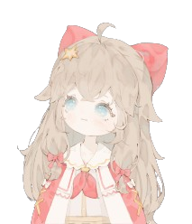

<!-- ══════════════════════════════════════════════════════════
     STARK — GitHub Profile README
     ══════════════════════════════════════════════════════════ -->

<!-- Visitor Counter -->

  

<!-- Typing Header -->

  

<!-- Name -->

  
  
  <h1>
    Hi, I'm Stark ⛩
  </h1>
  

    <em>- Usually lazy, but not when it's about code</em>
     
    <em>- Finding simple, creative solutions to complex problems</em>
     
    <em>- Loves collaborating and building in the open-source community</em>
  

   

## ☕ About Me

Fell in love with coding back in 8th grade and haven't stopped since. Always exploring new technologies and pushing myself to learn something new every day.

- 🌟 Passionate about the open-source community and always looking to contribute.
- 🫧 Always ready to collaborate.
- 💭 Got an idea? Let's build it.
- 🎐 [urstarkz@proton.me](mailto:urstarkz@proton.me)

## ☁️ Tech Stack

  

<blockquote align="center">
  "There's always a loophole, you just need to find it."
</blockquote>

## 🌸 GitHub Stats

  
  

## 🌷 Activity Insights

 

## ✨ Achievements

  

## 🍡 Contribution Graph

  

 

## 📖 Currently Exploring

- 🎙️ Deep diving into **React** and **Node.js** to build full-stack applications
- 👾 Building an AI assistant in **Python**, inspired by Iron Man's FRIDAY
- 🍡 Creating and experimenting with advanced Telegram bots
- ☁️ Exploring ways to make web apps more intuitive and aesthetic

## ✨ Open to Collaborate

I'm actively looking to contribute to interesting open-source projects and collaborate with other developers. If you're building something in the Python / React / TypeScript / Node.js space — or anything ambitious and purposeful — let's talk.

⭐ <em>Stars on any repo genuinely keep the momentum going!</em>

## 👀 Connect With Me

  
  &nbsp;&nbsp;&nbsp;&nbsp;
  

  
  
  
  
  

  

