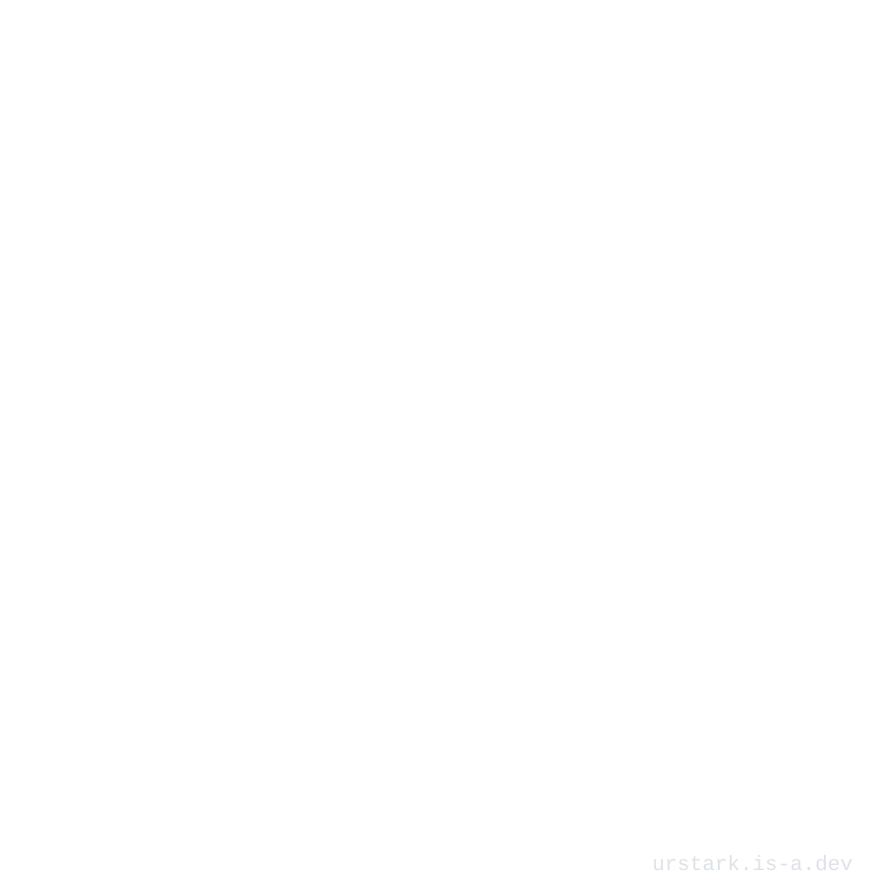

<!-- ══════════════════════════════════════════════════════════
     STARK - GitHub Profile README
     ══════════════════════════════════════════════════════════ -->

<!-- Visitor Counter -->

  

<!-- Typing Header -->

  

  
  

 

  

## Github Stats

  

  
  

  

 

## 📖 Currently Exploring

- Integrating **AI & LLMs** to automate workflows and add intelligence
- Fine-tuning **Prompt Engineering** for agents and RAG systems
- Building complete **Web Apps** with React, Next.js, and Node.js
- Creating custom **Telegram bots** and automation scripts

 

## ✨ Open to Collaborate

I'm actively looking to collaborate on interesting and purposeful projects. Whether it's AI integration, full-stack web development, or creative automation scripts - if you have an idea, let's build it!

 

⭐ <em>Stars on any repo genuinely keep the momentum going!</em>

 
 

  

  
  &nbsp;&nbsp;&nbsp;&nbsp;
  

  
  
  
  

  

     Thanks <a href="https://github.com/chwrryroll">Chwrryroll</a> for beautiful Stats Card :)

